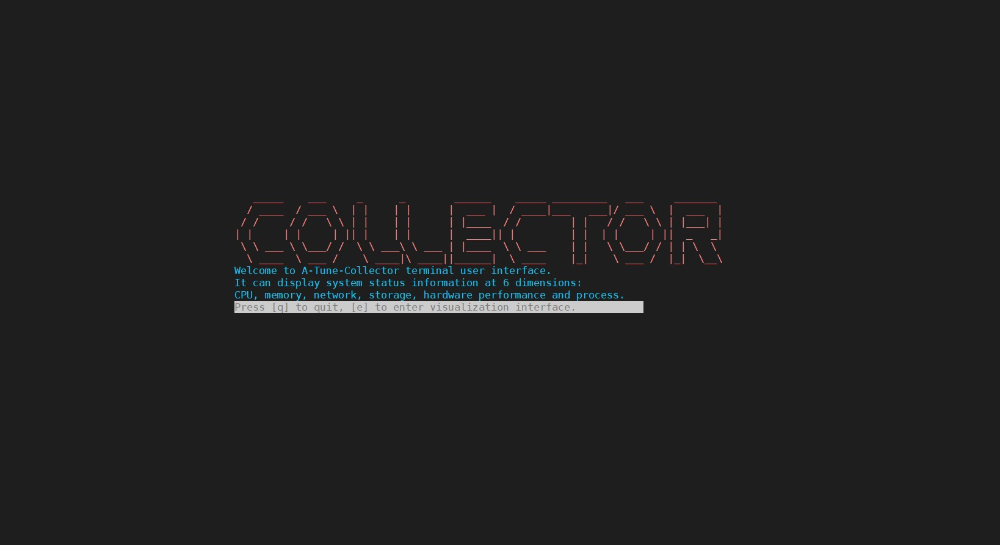
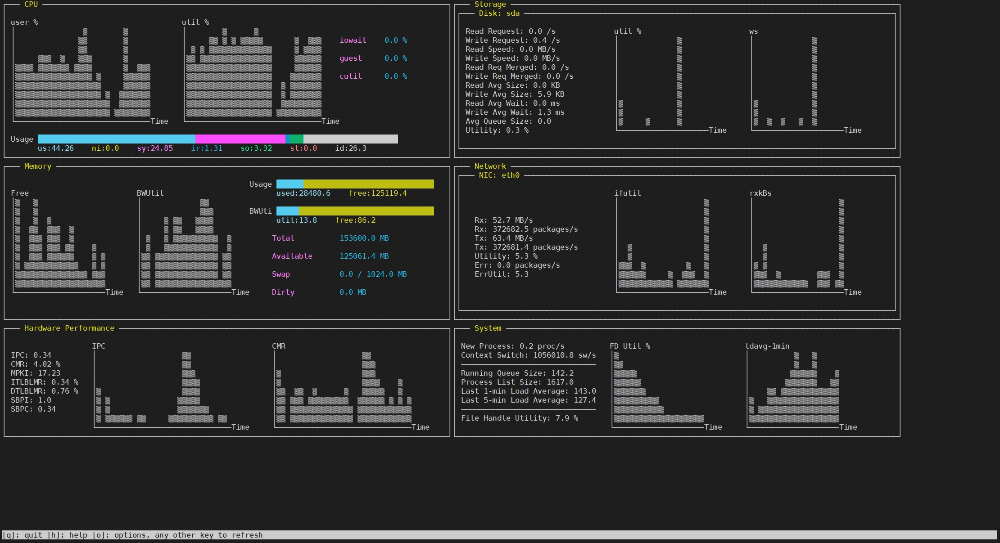

# A-Tune-Collector命令行终端可视化界面

本功能在A-Tune-Collector采集到的多维度数据基础上开发，支持在命令行终端呈现，提供数据直接显示、数据条和柱状图的可视化方案。

## 功能介绍

A-Tune-Collector采集到的数据分为六大部分：

* CPU（处理器）
* memory（内存）
* storage（硬盘）
* network（网卡）
* hardware performance（其他硬件统计信息，主要是CPU的，比如IPC，Cache Miss比例等）
* system（进程信息，文件句柄等）

当用户使用采集工具时，本扩展功能为得到的大量数据提供了一个直观的可视化方案，便于在命令行终端界面呈现。

同时，只要是通过collector工具采集保存的文件，都可以通过本功能进行可视化，进行人为的性能瓶颈分析。

## 如何使用

### 方式1：在线采集、动态展示

进入atune_collector下的ui目录，执行：

```
python3 cli.py [-c ***.json]
```

| 可选参数     | 默认值                                 | 描述                       |
| ------------ | -------------------------------------- | -------------------------- |
| -c, --config | /etc/atune_collector/collect_data.json | 采集数据时所配置的json文件 |

### 方式2：离线采集、静态展示

运行A-Tune-Collector采集功能，完成后cd进入atune_collector下的ui目录。

```sh
python3 cli.py [-f ***.csv] [-c ***.json]
```

| 可选参数     | 默认值                                 | 描述                                                                  |
| ------------ | -------------------------------------- | --------------------------------------------------------------------- |
| -c, --config | /etc/atune_collector/collect_data.json | 采集数据时所配置的json文件                                            |
| -f, --file   | ./example/test.csv                     | 保存采集数据的csv文件，存放的目录可在运行采集前通过json文件配置和查看 |

要保证json配置文件中的采集项和实际csv文件中保存的采集项一致。

## 运行终端要求

需保证**终端宽高大于200*50**，若终端尺寸不够，会提示进行调整，随后进入初始化界面：



按e键进入界面，按q键退出：



直接显示的数据项以及数据条中的数据都是采集过程中的平均值，而柱状图会根据相应项每一轮采集时的数据进行绘制。

## TO BE DONE

- 柱状图可视化项

  - 添加坐标轴（横纵轴）刻度
  - 支持通过方向键对绘图进行定位和切换
  - 在数据显示不全的情况下支持通过方向键对柱状图显示区域进行移动
- 多网卡和多磁盘采集项的显示优化
- 支持不同csv文件切换显示，提供用户自行选择
- 竖屏支持
- 代码重构与精简
- 更多功能配置支持......
